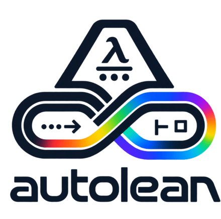
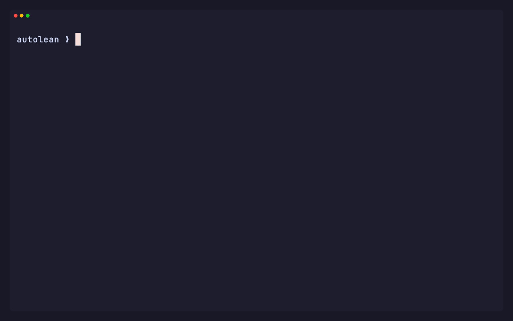
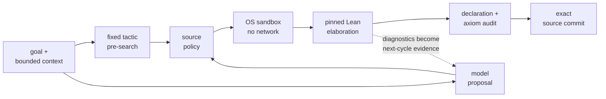

<p align="center">
  <picture>
    <source media="(prefers-color-scheme: dark)"
            srcset="docs/assets/logo-dark.png">
    
  </picture>
</p>

<p align="center">
  <a href="https://github.com/LeonardAukea/autolean/actions/workflows/ci.yml"></a>
  <a href="https://github.com/leanprover/lean4/releases/tag/v4.33.0"></a>
  <a href="LICENSE"></a>
</p>

AutoLean turns a mathematical goal into a reviewable research plan, a Lean 4
declaration, and a kernel-checked proof. Every accepted result is an auditable
derivation: the proof commit binds the source to the identity of the exact
Lean, Mathlib, and dependency closure that checked it, to the proof hash, and
to the transitive axiom report, so the theorem can be re-checked in the same
pinned environment. The model, prompt layers, and search evidence behind it
are recorded per attempt and travel with an export. Acceptance itself is
earned — a source policy, an operating-system sandbox, elaboration by the
pinned toolchain, and a declaration and axiom audit stand between a proposal
and a commit.

AutoLean is alpha research software. A successful run proves the exact Lean
statement shown in the result. It does not prove that a generated statement
faithfully expresses an informal claim.

<p align="center">
  
</p>

<p align="center">
  <a href="docs/assets/autolean-pythagorean.mp4">MP4</a>
  ·
  <a href="docs/demos/pythagorean.tape">VHS source</a>
  ·
  <a href="docs/demos/pythagorean.json">Run manifest</a>
</p>

The recording runs the front-page workflow live with the configured Claude
backend: a reviewed mathematical plan, an isolated formalization compiled
before proof search, a bounded proof session, and a kernel-checked commit
exported as a standalone Lean project. It adds one `--guide` fixing the
geometric statement and the Mathlib lemma that closes it, so the run is
reproducible; the VHS source holds the exact command. Playback runs at
four times speed — the session behind it takes minutes, most of them
spent in Lean. A second recording
[audits a real formalization paper](docs/assets/autolean-ionescu-tulcea.gif)
(arXiv:2506.18616v5) —
[MP4](docs/assets/autolean-ionescu-tulcea.mp4) ·
[VHS source](docs/demos/ionescu-tulcea.tape) ·
[run manifest](docs/demos/ionescu-tulcea.json). Each tape holds the live
command; each manifest identifies the run.

## Start here

Nix supplies the pinned Python, Lean, Mathlib, CSLib, and sandbox tools.

```bash
git clone https://github.com/LeonardAukea/autolean.git
cd autolean
nix develop

autolean models
claude                    # enter /login
# or: codex login
autolean doctor
autolean prove "the Pythagorean theorem" --review-plan --max-attempts 5
```

The automatic default selects the strongest profile for an authenticated
Claude or Codex subscription, or an Anthropic or OpenAI API key. Name a local
model explicitly with `--model` or in `program.md`. See
[Choose and switch models](docs/how-to/choose-a-model.md).

Use `autolean workbench` for the interactive interface. The
[first-proof tutorial](docs/tutorials/first-proof.md) walks each step and ends
with a standalone Lean project and companion LaTeX paper. CI replays that
tutorial against a scripted model on every change, so the documented path
stays the working path.

## Workflows

- `autolean plan STATEMENT` develops a mathematical strategy without changing
  source.
- `autolean prove STATEMENT` formalizes one claim and starts a bounded proof
  session.
- `autolean solve` works through existing `sorry` targets; `autolean resume`
  continues saved work.
- `autolean verify SOURCE` extracts and formalizes claims from arXiv HTML,
  PDF, or a local paper.
- `autolean problems` searches curated open problems and creates bounded work.
- `autolean export OUTPUT` writes a standalone Lean project, provenance
  manifest, and companion LaTeX paper.

Every mutating workflow records a resumable session and runs under an explicit
cycle budget. The loop learns from both outcomes: classified failure evidence
redirects the next attempt, and each accepted proof becomes a ranked skill
offered to later prompts. The
[research loop](docs/explanation/research-loop.md) explains the full cycle.

## How a proof gets accepted



The Lean project and pinned dependencies are trusted inputs. Model responses,
paper text, search results, and learned skills are untrusted data. Lean's
parser, elaborator, and kernel decide acceptance; everything before them can
only reject early. The
[trust boundary](docs/explanation/trust-boundary.md) states the complete
security and data-handling model, including [why elaboration runs in an OS
sandbox][sandbox-rationale].

[sandbox-rationale]: docs/explanation/trust-boundary.md#why-an-operating-system-sandbox

## Documentation

The documentation follows the four-part [Diátaxis](https://diataxis.fr/)
structure; the [documentation index](docs/README.md) lists every page. Start
with the [first-proof tutorial](docs/tutorials/first-proof.md), the
[architecture](docs/explanation/architecture.md), and the
[trust boundary](docs/explanation/trust-boundary.md).

## Requirements

- macOS on Apple Silicon, AArch64 Linux, or x86-64 Linux
- Nix with flakes enabled
- a supported model subscription, hosted API, or local inference server

The Python package supports Python 3.11 through 3.14; the Nix development
shell is the release-qualified environment. The core is MIT licensed; PDF
extraction is an explicit extra with its own license terms. The
[dependency reference](docs/reference/dependencies.md) lists installation
profiles and the license boundary.

## Contributing and security

Read [CONTRIBUTING.md](CONTRIBUTING.md) before changing code or documentation.
Report vulnerabilities through the private process in
[SECURITY.md](SECURITY.md). [SUPPORT.md](SUPPORT.md) routes questions and bug
reports. [GOVERNANCE.md](GOVERNANCE.md) states ownership and decisions.
User-visible changes are recorded in [CHANGELOG.md](CHANGELOG.md).

AutoLean is available under the [MIT License](LICENSE).
