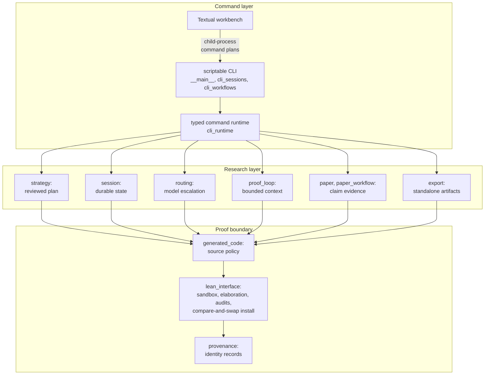

# Architecture

AutoLean is a pipeline with one owner for each decision. Command adapters
collect intent. Domain services produce plans and candidate source. The proof
boundary accepts exact bytes only after Lean validates them.

## Command layer

`autolean.__main__` owns the public command grammar, help layout, and output.
`cli_sessions` owns persistent session commands. `cli_workflows` adapts
research, maintenance, and compatibility workflows to Click.

`cli_runtime` is the shared construction boundary. It owns command options,
model precedence, backend preflight, agent construction, model escalation,
session execution, and accepted-source installation. Command modules call this
typed API directly.

The Textual workbench builds child-process command plans. The scriptable CLI
and interactive interface therefore exercise the same commands and records.

## Research layer

The research loop is represented by small records and services:

- `strategy` owns the reviewed mathematical plan;
- `session` owns durable continuation state;
- `routing` owns evidence-based model escalation;
- `proof_loop` owns bounded prompt context;
- `paper` owns source acquisition and text extraction;
- `paper_workflow` composes paper evidence through explicit service protocols;
- `export` owns standalone Lean and LaTeX artifacts.

These modules exchange typed values. A model name, proof plan, paper identity,
session, and accepted source remain distinct values across the pipeline.

## Proof boundary

`generated_code` validates model-produced source before execution.
`lean_interface` owns sandboxed compilation, declaration binding, axiom audit,
and compare-and-swap installation. `provenance` identifies the source,
toolchain, dependency graph, artifacts, and accepted proof.

The complete authority and threat model lives in
[Trust boundary](trust-boundary.md).

## Dependency direction

Command adapters depend on the typed runtime and domain services. Domain
services depend on records and proof-boundary primitives. The proof boundary
depends on source, project, policy, and provenance values. This direction
keeps one kernel path usable from the CLI, workbench, tests, and future
integrations.
