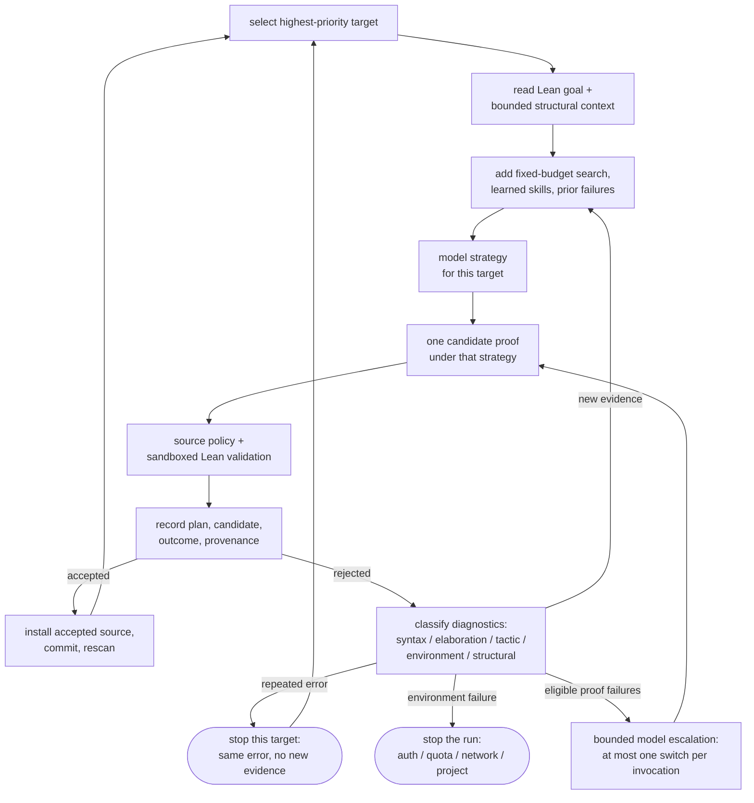

# Research and proof loop

The loop is built around small experiments. One attempt should either produce
an accepted proof or leave evidence that changes the next attempt.

## A plan is an object

Before source generation, AutoLean can record:

- the objective
- the proposed formalization
- examples and special cases
- invariants
- obstructions
- reductions
- premises to verify
- candidate methods
- partial results
- risks
- completion criteria
- checkpoints
- revision triggers

These fields keep mathematical choices reviewable. A long narrative can hide
a bad quantifier; an explicit formalization field cannot.

## One experiment

Each cycle performs the same steps:

1. Select the highest-priority target within the requested scope.
2. Read its Lean goal and bounded structural context.
3. Add fixed-budget local search, learned skills, and prior failure evidence.
4. Ask the active model for a target-specific proof strategy.
5. Ask that model for one candidate proof under the accepted strategy.
6. Apply the source policy and sandboxed Lean validation.
7. Record the plan response, candidate, outcome, and provenance.
8. Install only an accepted candidate, then rescan.

The order is stable. Prompt layers are separate: system rules, project
guidance, and ephemeral target evidence have different ownership and hashes.

The complete cycle, including what failure feeds back into the next attempt:

Each box is a recorded step: the session holds the plan response, the
candidate, the classified outcome, and the provenance for every cycle, so a
stopped run can be inspected and resumed without losing evidence.

## Failure changes the next question

Lean diagnostics are classified into syntax, elaboration, tactic, environment,
and structural categories. Repeating the same error without new evidence ends
work on that target. Authentication, quota, network, and project failures stop
the run because they say nothing about the mathematics.

A smaller model may recommend a stronger profile after eligible proof failures.
The switch is bounded to one per invocation. It retains the plan, target,
attempt budget, and recorded evidence. Model size is a resource decision, not
a substitute for repairing the formalization.

## Sessions outlive commands

Every mutating workflow writes an atomic session record in the Lean project;
the [artifact reference](../reference/research-artifacts.md) states its
location and shape. `resume` continues the latest active session or an
explicit ID. Guidance and model choice can change without losing the evidence
already gathered.

A run is bounded by default; unbounded work requires `--overnight` or an
explicit zero budget ([`max_cycles`](../reference/program.md)). This makes a
normal command cheap to stop, inspect, and continue.

## Mathematical discipline

Examples test the statement before proof search. Obstructions expose missing
hypotheses. Reductions name the smaller claim that would settle the goal.
Premises are checked against the local project and Mathlib before a model is
asked to improvise.

This structure follows Terence Tao's practical advice on [examples and special
cases][examples], [skeptical checking][skepticism], [partial progress][partial],
and [flexible plans][flexibility].
Research briefs bind definitions and semantic boundaries to primary sources;
the [Gromov archive](https://www.ihes.fr/~gromov/) is one source used by the
curated geometry work.

The implementation also draws on the fixed-budget experiment discipline in
[autoresearch](https://github.com/karpathy/autoresearch), the bounded context
and durable-state model in
[Hermes Agent](https://github.com/NousResearch/hermes-agent), and the explicit
done conditions described in
[Loop Engineering](https://addyosmani.com/blog/loop-engineering/).

The kernel settles the formal theorem. A distinguished mathematical workflow
also asks whether the theorem is the right one. Plans, source citations,
counterexamples, and human review own that question.

[examples]: https://terrytao.wordpress.com/career-advice/solving-mathematical-problems/
[skepticism]: https://terrytao.wordpress.com/career-advice/be-sceptical-of-your-own-work/
[partial]: https://terrytao.wordpress.com/career-advice/on-the-importance-of-partial-progress/
[flexibility]: https://terrytao.wordpress.com/career-advice/be-flexible/
