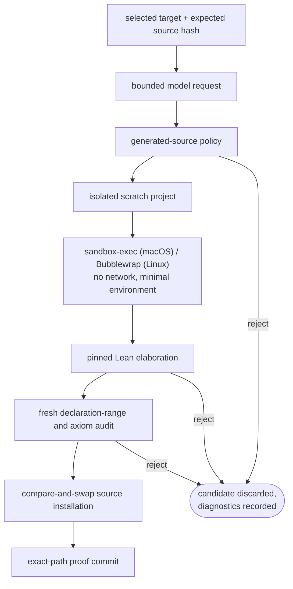

# Trust boundary

AutoLean runs code written by a model. The product of a run is an auditable
derivation: exact source bytes, a pinned Lean and Mathlib closure, and a
recorded identity for every accepted proof — the
[environment reference](../reference/environment.md) states that record. This
page defines the boundary that keeps the record trustworthy while generated
code executes: what is trusted, what is data, and which layer owns each
rejection.

## Inputs and authority

The selected Lean project, pinned Lean executable, and resolved dependencies
are trusted. Model completions, paper text, nearby source comments, search
results, structural outlines, learned skills, and previous failures are data.

Lean's parser, macro expander, elaborator, and kernel are the semantic
authority. Tree-sitter, regex scanners, model criticism, and source policy
checks can reject a candidate early. None can accept one.

## Acceptance sequence

The generated candidate and compiler outputs live in a temporary directory.
The validator invokes the pinned Lean binary directly with compiled project
dependencies. It does not run project build scripts over generated source.

## Source policy

The policy rejects source that carries authority beyond a proof body:

- `sorry`, `admit`, new axioms, and unsafe declarations
- imports and environment-changing commands
- explicit process, file, network, and dynamic-library operations
- elaborator hooks and command execution surfaces
- hidden bidirectional controls and malformed Unicode
- proof bodies above the configured line bound

This is defense in depth. Lean elaboration can execute metaprograms, so the
operating-system sandbox owns process, filesystem, environment, and network
containment.

## Why an operating-system sandbox

Elaborating Lean source is executing a program. Macros, `elab` rules, and
tactic frameworks run arbitrary compiled code inside the elaborator, so
checking an untrusted candidate is code execution, whatever the candidate
looks like. The layers above the sandbox cannot carry this responsibility:

- The source policy is a syntactic filter. It rejects the obvious escape
  hatches, and a determined payload can be disguised from any scanner that
  does not run the code.
- The kernel guarantees logical soundness. It says nothing about what the
  elaborator did to the host while producing the term it checks.

The sandbox is the one layer whose guarantee does not depend on the
candidate's content: no network, a minimal environment, and a filesystem view
restricted to the scratch project, enforced by the operating system.

Its cost does not match its weight. Wrapping the Lean process in
`sandbox-exec` or Bubblewrap adds process-launch overhead of a few
milliseconds; the elaboration it contains imports Mathlib and runs for
seconds to minutes, dominated by work that would happen with or without the
sandbox. Containment is effectively free relative to what it contains.

## Declaration binding

A fresh Lean process imports the compiled candidate and asks Lean for the
requested declaration. Acceptance requires its recorded source range to
contain the exact selected target line. The same process walks the
declaration's transitive axioms.

The source edit replaces one expected `sorry` and must reduce the file's
placeholder count by one. The expected pre-edit hash prevents a concurrent
editor save from being overwritten. Git verifies the prepared branch and
commits only the accepted file.

## Structural context

Tree-sitter gives the model imports, namespace, declaration span, syntax path,
earlier referenced declarations, and neighbours. The context includes parser
and grammar versions, source SHA-256, recovery quality, and parse-error spans.
It is cached by source hash and bounded to 6,000 characters.

Lean projects can add syntax and macros at runtime. A recovered or unavailable
outline remains visible as advisory context; it never replaces the Lean goal
state.

## Provider boundary

Hosted and subscription models receive the selected declaration, nearby
source, goal state, prior failures, guidance, skills, and bounded search
results. Local profiles keep that data on infrastructure controlled by the
operator.

Provider credentials remain in the process environment. They do not enter
`program.md`, prompts, session records, or exported artifacts. OpenAI hosted
requests disable Responses API storage where the API exposes that control.
Other provider retention follows the selected service's terms.

`--dry-run` sends the same bounded request and runs the same source and Lean
checks. It does not install source or write logs, results, skills, or training
data.

## What a proof means

A passing result establishes the exact Lean declaration under the recorded
axioms and environment. It does not establish that a natural-language claim,
paper, or conjecture was formalized faithfully. That source-to-statement step
is a separate mathematical review.

`autolean doctor` builds the existing project after its generated smoke proof.
Run it only on a project whose source and dependencies you trust.
